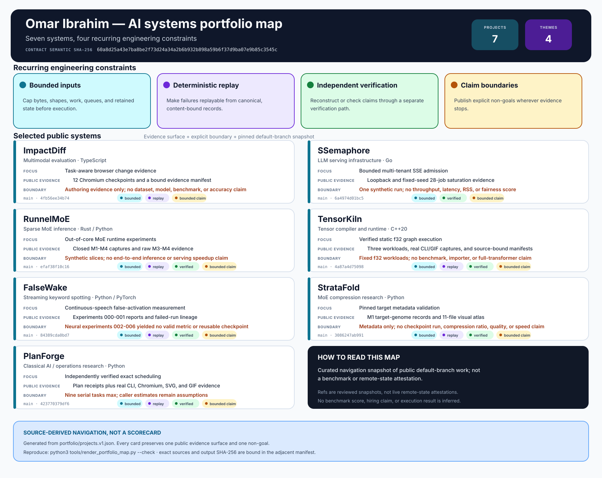

# Omar Ibrahim

I build reliable AI systems where model behavior meets browsers, streaming
protocols, storage, compilers, and experimental evidence. My work favors
bounded inputs, deterministic replay, independent verification, and explicit
claim limits.

This profile is a fast path through seven current systems projects. Each
summary below names the public evidence that exists today and the conclusion
that evidence does not support.

## Systems map



*Curated portfolio navigation.* The strict
[`portfolio/projects.v1.json`](portfolio/projects.v1.json) source binds every
card to a reviewed default-branch commit, one public evidence surface, and one
explicit non-goal. It is not a benchmark scorecard or live remote-state
attestation.

Reproduce the SVG and verify its exact two-file bundle:

```bash
python3 tools/render_portfolio_map.py --check
```

The adjacent
[manifest](assets/portfolio-systems-map.manifest.json) binds the contract,
renderer, semantic digest, seven immutable refs, and SVG bytes.

## Selected systems

### [ImpactDiff](https://github.com/omar07ibrahim/impactdiff) · TypeScript · Multimodal evaluation

Task-aware browser-change evidence for asking whether a visual change breaks a
user workflow or accessibility surface. The current authoring bundle contains
two synthetic applications, four workflows, and 12 real deterministic Chromium
checkpoints with accessibility, layout, action, provenance, and manifest
records. It contains no official pair, released dataset, trained model,
benchmark result, or accuracy claim.

### [SSemaphore](https://github.com/omar07ibrahim/ssemaphore) · Go · LLM serving infrastructure

A Linux loopback gateway for bounded multi-tenant Chat Completions traffic,
weighted-deficit admission, validated buffered/SSE relay, cancellation, and
signal-owned shutdown. Public evidence covers one controlled loopback workflow
and one fixed-seed 28-job saturation run whose dispatches match an independent
bounded oracle. It does not report throughput, latency, RSS, a fairness score,
or a service-share benchmark.

### [RunnelMoE](https://github.com/omar07ibrahim/runnelmoe) · Rust / Python · Sparse MoE inference

A model-agnostic laboratory for verified out-of-core expert storage, bounded
DRAM caching, cache-policy research, and a narrow BF16/AVX2 kernel. The closed
M1-M4 bundle exposes captured command output, raw evidence, source-bound
visuals, and explicit milestone reviews. Its M3 evidence measures synthetic
modeled traffic, and M4 covers fixed synthetic GEMV batches on one recorded
host; neither is an end-to-end inference or serving-speed claim.

### [TensorKiln](https://github.com/omar07ibrahim/tensorkiln) · C++20 · Tensor compiler/runtime

A dependency-free static `f32` compiler/runtime with checked graphs, explicit
rewrites, reverse-verified arena planning, independently reconstructed
execution plans, guarded allocation-free sessions, and a separate reference
interpreter. Source-bound release-CLI and visual evidence now exercises three
compiled-in workloads: the channel-affine slice proves
`mul_broadcast_f32 -> add_broadcast_f32` with 6/6 raw output words independently
matched, while the six-step ReGLU slice remains separately captured. The
project makes no benchmark, general-model, importer, or full-transformer claim.

### [FalseWake](https://github.com/omar07ibrahim/falsewake) · Python / PyTorch · Streaming keyword spotting

An open-set keyword-spotting research system built around the failure mode that
clip accuracy misses: false activations on continuous unrelated speech.
Experiments 000 and 001 provide the measured linear baseline and development
replay; all 1,001 registered thresholds failed the joint retention and
false-event gates. Experiments 002-006 are retained engineering and incident
evidence only: they produced no valid neural metric, reusable checkpoint, ONNX
result, or continuous-replay score.

### [RoleProof](https://github.com/omar07ibrahim/roleproof) · JavaScript / Python · Symbolic access-policy security

A dependency-free analyzer for bounded RBAC graphs with deterministic shortest
escalation witnesses, Tarjan cycle reporting, scoped witness cuts, and an
independent Floyd–Warshall verifier that never imports the analyzer. Public
evidence includes 25 tests across Node 22/24 plus real CLI, desktop, mobile,
full-page, GIF, SVG, and JSON artifacts bound to pinned Chromium and source
hashes. The Orion policy is synthetic; there is no live IAM, enforcement,
benchmark, compliance, or globally sufficient remediation claim.

### [PlanForge](https://github.com/omar07ibrahim/Todo) · Python · Classical AI / operations research

A dependency-free exact scheduler for dependency-aware single-day planning with
a separate optimality verifier, canonical SHA-256 receipts, safe CLI bundles,
and a loopback-only dashboard. Public evidence includes 32 tests across Python
3.11-3.14 plus real CLI, Chromium desktop/mobile, SVG, and GIF captures bound
by a manifest. Exact mode is capped at nine serial tasks; it does not model
multi-user calendars, and caller estimates remain assumptions.

## Additional maintained systems

- [IntentGate](https://github.com/omar07ibrahim/intentgate) · Python ·
  Agentic AI safety — released
  [v0.1.0](https://github.com/omar07ibrahim/intentgate/releases/tag/v0.1.0)
  with deterministic proposal admission, human manager and privacy approvals,
  tenant/TTL/replay/one-effect controls, an independently verified hash ledger,
  and a
  [13-file source-bound evidence bundle](https://github.com/omar07ibrahim/intentgate/tree/eaf5265ac9bb23fc564157d2bf3c4cfa7d390216/docs/evidence);
  the synthetic HR fixture is not a model-quality result, regulatory-compliance
  claim, production security certification, or third-party integration.
- [StrataFold](https://github.com/omar07ibrahim/stratafold) · Python ·
  MoE compression research — a pinned official-metadata target genome, raw M1
  records, a deliberate rejection path, and an 11-file visual atlas; no full
  checkpoint, compression-ratio, quality, throughput, or speed claim.
- [OrthoDrift](https://github.com/omar07ibrahim/orthodrift) · Python ·
  Multilingual retrieval robustness — released
  [v0.1.0](https://github.com/omar07ibrahim/orthodrift/releases/tag/v0.1.0)
  with typed grapheme provenance, globally minimal supplied-edit proofs, exact
  artifact replay, a verified offline report, and a
  [13-file source-bound visual bundle](https://github.com/omar07ibrahim/orthodrift/tree/44e7fdc2e208db445569f31f2808e58340b9104b/docs/evidence);
  the synthetic Şəki fixture is not a broad benchmark, dense-retrieval result,
  or native-language review.
- [SensorProof](https://github.com/omar07ibrahim/sensorproof) · Python ·
  Fault-aware robotics / sensor fusion — released
  [v0.1.0](https://github.com/omar07ibrahim/sensorproof/releases/tag/v0.1.0)
  with deterministic fixed-point fusion, independently replayable decision
  certificates, 38/38 abrupt fault observations rejected or quarantined, a
  98.18% RMSE reduction against the identical-stream ungated baseline, and a
  [13-file source-bound evidence bundle](https://github.com/omar07ibrahim/sensorproof/tree/4e6fda8129604f00d722c653398741e93c8a040c/docs/evidence);
  the synthetic step-fault scenario is not a slow-ramp, correlated-fault,
  real-vehicle, production-covariance, or safety-certification claim.
- [PEFTLint](https://github.com/omar07ibrahim/peftlint) · Python · Model artifact
  tooling — fail-closed LoRA checkpoint admission, eight real CLI cases, and an
  explicit UNKNOWN compatibility boundary.
- [Netveil](https://github.com/omar07ibrahim/netveil) · Python · Privacy and
  supply-chain security — offline pseudonymized audit receipts, guarded wheel
  execution, a published v0.3.0 evidence bundle, and explicit disclosure limits.
- [K2DO](https://github.com/omar07ibrahim/k2do) · Python · Agent orchestration —
  a provenance-explicit nanobot derivative with routed DeepThink, real MCP
  subprocess fault labs, bounded cancellation, and three source-bound visual
  evidence suites.
- [MeasureTrace](https://github.com/omar07ibrahim/measuretrace) · Python · Exact
  computing — rational m/km/mi conversion, independently recomputed receipts,
  reproducible packages, and real responsive browser captures.
- [ShardLift](https://github.com/omar07ibrahim/shardlift) · Python / PyTorch ·
  Distributed training — crash-consistent checkpoints, deterministic recovery,
  and auditable real-SIGKILL evidence.
- [KVCrucible](https://github.com/omar07ibrahim/kvcrucible) · Rust / Python · LLM
  inference reliability — an offline conformance lab for unreliable KV-cache
  event streams, explicit uncertainty, replayable witnesses, and fault-injection
  evidence.

Also maintained: [RecallLedger / note](https://github.com/omar07ibrahim/note) ·
[UnitSentinel / units](https://github.com/omar07ibrahim/units) ·
[Casefold / case](https://github.com/omar07ibrahim/case) ·
[PasswordGenerator](https://github.com/omar07ibrahim/PasswordGenerator) ·
[GWorker](https://github.com/omar07ibrahim/GWorker) ·
[WitnessGap](https://github.com/omar07ibrahim/witnessgap) ·
[A1220](https://github.com/omar07ibrahim/A1220-lab1-omar07ibrahim)

## Engineering approach

- State the trust boundary and non-goal before making a claim.
- Bound bytes, shapes, work, queues, retained state, and diagnostics.
- Prefer deterministic state machines, property tests, pinned toolchains, and
  machine-readable evidence.
- Keep optimized paths answerable to a separate reference or verifier.
